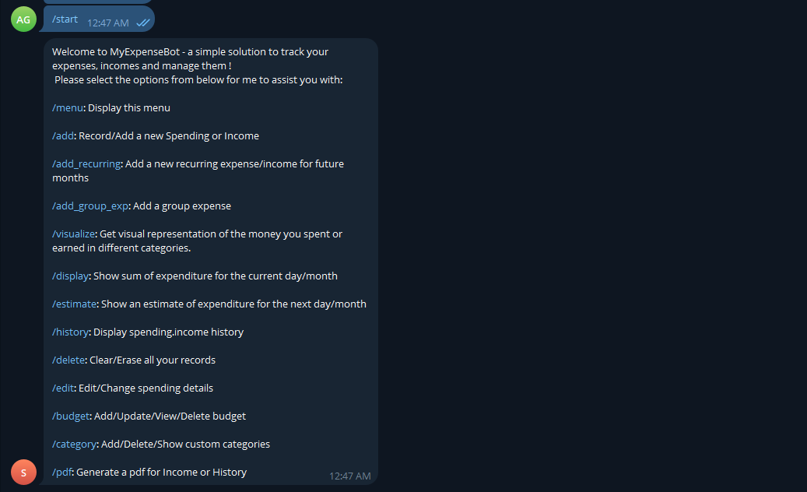
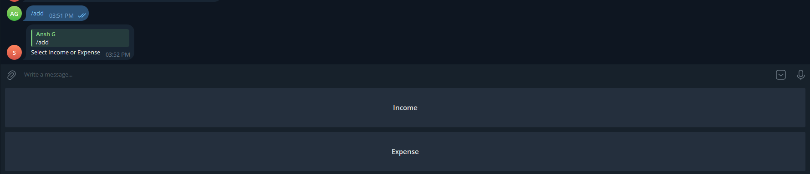
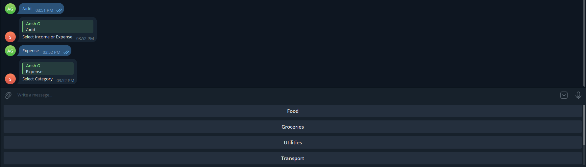
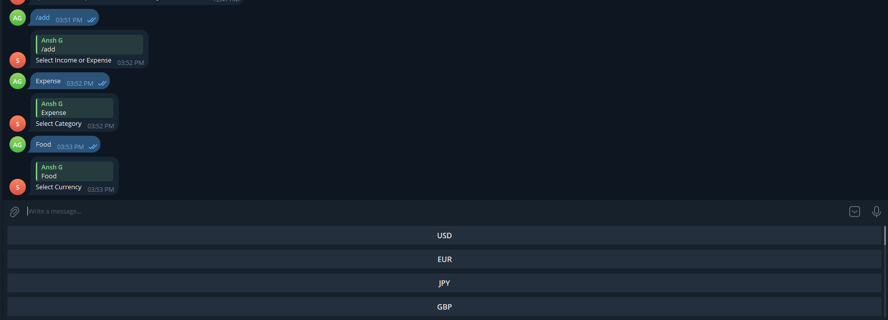
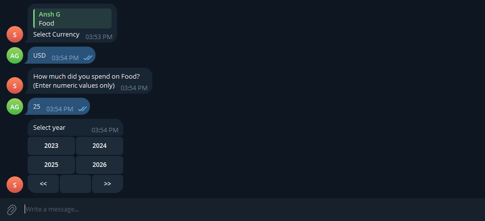
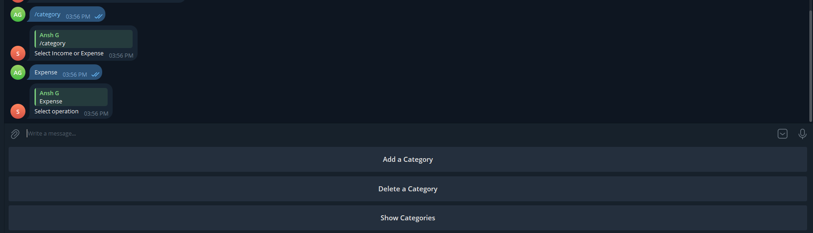
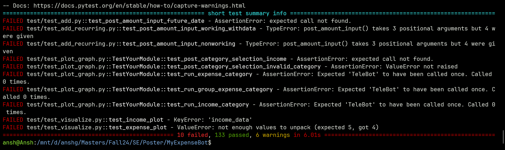

# SplitIT (formerly MyExpenseBot)

## About MyExpenseBot (Version i)
- A telegram bot used to manage expenses
- Python-based logic
- Support for group expenses
- Multi-currency expenses
- Custom category support
- Visualizations for category-wise expenditure

## MyExpenseBot -> SplitIT (Version i+1)
- Move from being tightly-coupled with telegram to standalone UI and PWA support
- Integration of database to enable multi-devise sync
- Split by shares and support for unequal splits
- Scan receipt functionality to split bills quickly

## Screenshots from the current version setup

1. Currently available menu options

2. Option for adding Income and Expenses

3. Inbuilt categories

4. Multi-currency support

5. Date configuration

6. Custom category support

7. Ton of pre-written test
